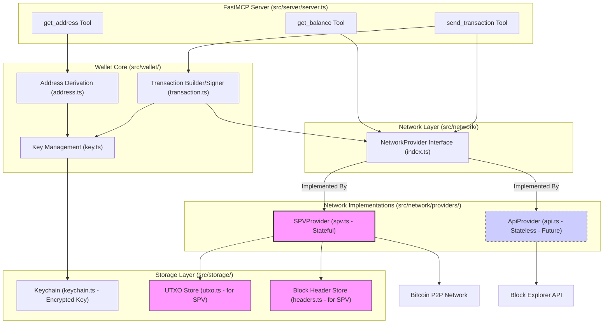

# System Patterns: Bitcoin Wallet MCP Server

## Architecture Overview (Simple SPV Wallet - Stateless Ready)

The architecture is designed around a simple SPV wallet with a single private key, aiming for stateless readiness.

1.  **MCP Interface Layer (`src/server/server.ts`, `src/tools/`)**: Uses `fastmcp` to expose tools (`get_address`, `get_balance`, `send_transaction`). Tool logic orchestrates calls to the Wallet Core and Network Layer.
2.  **Wallet Core (`src/wallet/`)**: Contains the core Bitcoin logic:
    *   `key.ts`: Manages the single private key (generation, encryption, decryption via Keychain).
    *   `address.ts`: Derives the Bitcoin address from the public key.
    *   `transaction.ts`: Builds and signs transactions using UTXOs and the private key.
3.  **Network Layer (`src/network/`)**: Defines a `NetworkProvider` interface for interacting with the Bitcoin network (fetching balance/UTXOs, broadcasting).
    *   `providers/spv.ts`: Initial stateful implementation using SPV. Connects to peers, downloads headers, verifies transactions, and manages local UTXO state.
    *   `providers/api.ts` (Future): Stateless implementation using external APIs.
4.  **Storage Layer (`src/storage/`)**: Handles persistence.
    *   `keychain.ts`: Interacts with the OS secure keychain to store/retrieve the *encrypted* private key.
    *   `utxo.ts`, `headers.ts` (Future): Local storage needed for the SPV provider's state.

## Core Components (Refined for SPV)

### MCP Tool Handler (`src/server/server.ts`)
- Uses `fastmcp` to define and expose tools.
- Validates parameters using `zod` schemas (`src/types/index.ts`).
- Calls appropriate Wallet Core and Network Layer functions.

### Key Manager (`src/wallet/key.ts`)
- Generates a single private key on first run.
- Encrypts/decrypts the key using `WALLET_PASSWORD` from `src/config/index.ts`.
- Uses `src/storage/keychain.ts` for secure storage of the encrypted key.
- Provides the decrypted key *only* for signing operations, then discards it.

### Address Manager (`src/wallet/address.ts`)
- Derives the public key from the private key.
- Generates the corresponding Bitcoin address (e.g., Bech32 for testnet/mainnet).

### Transaction Builder (`src/wallet/transaction.ts`)
- Selects appropriate UTXOs (obtained from the `NetworkProvider`).
- Constructs the transaction.
- Signs the transaction using the decrypted private key obtained from Key Manager.

### Network Provider (`src/network/index.ts`, `src/network/providers/`)
- Defines the interface for network operations (`getBalance`, `getUTXOs`, `broadcastTransaction`, etc.).
- `SPVProvider`: Implements the interface using P2P connections and local state (block headers, UTXOs).
- (Future) `ApiProvider`: Implements the interface using external block explorer APIs.

### Keychain Storage (`src/storage/keychain.ts`)
- Provides an abstraction layer over `node-keytar` (or similar) for OS keychain access.
- Stores and retrieves the encrypted private key securely.

## Data Flow Patterns (Refined for SPV)

### First Run / Key Generation
1. Server starts.
2. `KeyManager` checks keychain for existing encrypted key.
3. If not found:
    - Generate a new private key.
    - Encrypt key using `WALLET_PASSWORD`.
    - Store encrypted key in keychain via `KeychainStorage`.

### Get Address (`get_address` tool)
1. Tool receives request.
2. `KeyManager` retrieves encrypted key from `KeychainStorage`.
3. `KeyManager` decrypts key using `WALLET_PASSWORD`.
4. `AddressManager` derives public key and generates address.
5. Decrypted key is discarded.
6. Address is returned to the client.

### Get Balance (`get_balance` tool)
1. Tool receives request.
2. `KeyManager` retrieves/decrypts key, `AddressManager` gets address (as above).
3. Tool calls `NetworkProvider.getUTXOs(address)`.
    - `SPVProvider` checks its local UTXO store.
    - (Future) `ApiProvider` calls external API.
4. Tool calculates total balance from UTXOs.
5. Balance is returned to the client.

### Send Transaction (`send_transaction` tool)
1. Tool receives request (address, amount).
2. Tool validates parameters.
3. Tool calls `NetworkProvider.getUTXOs(own_address)` to get available funds.
4. `TransactionBuilder` selects UTXOs, calculates fees, creates transaction structure.
5. `KeyManager` retrieves and decrypts the private key.
6. `TransactionBuilder` signs the transaction using the decrypted key.
7. Decrypted key is discarded.
8. Tool calls `NetworkProvider.broadcastTransaction(signedTx)`.
    - `SPVProvider` broadcasts to connected peers.
    - (Future) `ApiProvider` calls external API.
9. Transaction ID is returned to the client.

## Security Patterns (Refined for SPV)

### Key Management
- **Single Key**: Only one private key is managed.
- **Encryption**: Key encrypted using `WALLET_PASSWORD` (AES-256-GCM recommended).
- **Storage**: Encrypted key stored in OS keychain via `node-keytar`.
- **In-Memory Handling**: Decrypted key exists in memory only briefly during signing operations.

### Authentication & Authorization
- Relies on the security of the environment where the MCP server runs.
- Access control is managed by the client connecting to the MCP server.
- `WALLET_PASSWORD` is provided via environment variable, assumed secure.

### Data Protection
- Encryption of the private key at rest (keychain).
- No sensitive data logged.

## Integration Patterns

### Bitcoin Network Integration
- **SPV**: Direct P2P connection to Bitcoin nodes (testnet/mainnet configurable). Requires managing peer connections and SPV state.
- **(Future) API**: Connection to external block explorer APIs. Simpler, relies on third-party trust.

### OS Integration
- **Keychain**: Uses `node-keytar` or similar for secure storage, potentially requiring platform-specific setup or dependencies.

## Error Handling Patterns

- Use `fastmcp`'s `UserError` for client-facing errors (e.g., invalid address, insufficient funds).
- Implement specific error types for internal issues (e.g., keychain access error, network connection error).
- Log internal errors thoroughly for debugging.
