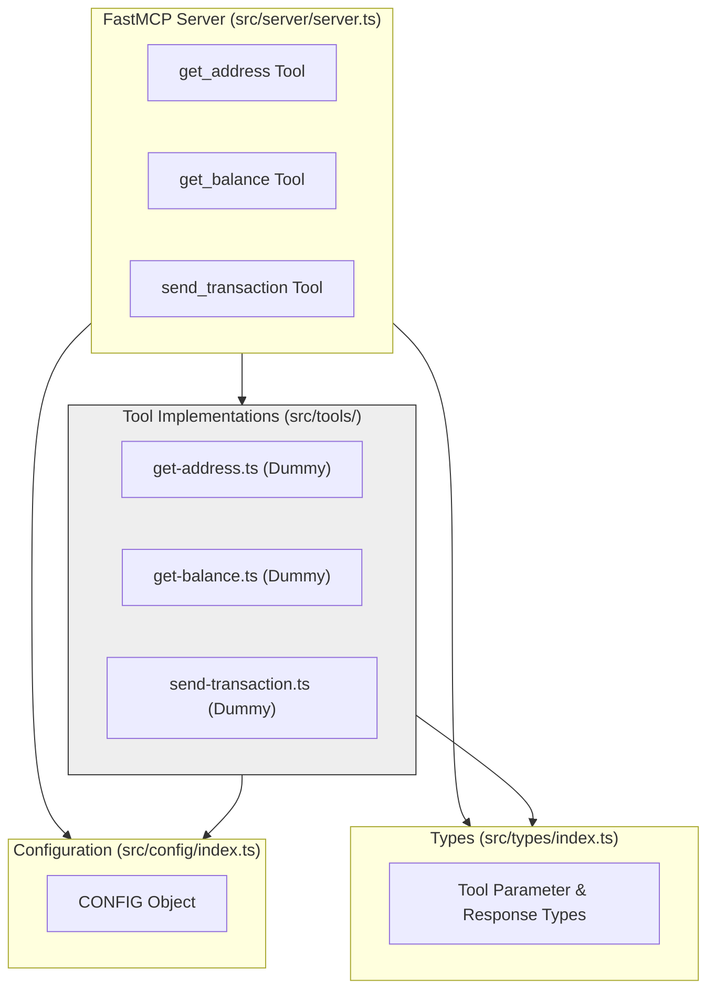

# System Patterns: Bitcoin Wallet MCP Server

## Architecture Overview (Current Scaffold)

The current architecture consists of the basic scaffold created using `fastmcp`.

1.  **MCP Server (`src/server/server.ts`)**: Initializes `fastmcp`, loads configuration, registers the defined tools, and starts the server using stdio transport.
2.  **Tool Implementations (`src/tools/`)**: Contains the dummy implementations for the three core tools (`get_address`, `get_balance`, `send_transaction`). These currently return hardcoded values and do not interact with any real wallet or network logic.
3.  **Configuration (`src/config/index.ts`)**: Defines basic server configuration constants and reads the `WALLET_PASSWORD` environment variable (though it's not used by the dummy tools yet).
4.  **Types (`src/types/index.ts`)**: Defines TypeScript types based on `zod` schemas for tool parameters and responses, ensuring type safety in the tool implementations.
5.  **Placeholders**: Directories and placeholder files exist for `src/wallet`, `src/network`, `src/storage`, and `src/utils`, outlining the intended structure for future implementation but containing no functional code yet.

## Core Components (Current State)

### MCP Tool Handler (`src/server/server.ts`)
- Uses `fastmcp` to define and expose the three tools.
- Imports tools directly from their implementation files in `src/tools/`.
- Validates parameters for `send_transaction` using the `zod` schema defined in `src/types/index.ts`.

### Tool Implementations (`src/tools/`)
- **`get-address.ts`**: Returns a hardcoded testnet address.
- **`get-balance.ts`**: Returns a hardcoded balance string.
- **`send-transaction.ts`**: Accepts parameters, performs schema validation, and returns a hardcoded transaction ID string.

*(Note: No Key Manager, Address Manager, Transaction Builder, Network Provider, or Keychain Storage components are implemented yet.)*

## Data Flow Patterns (Current State)

### Get Address (`get_address` tool)
1. Client calls `get_address`.
2. `fastmcp` routes to `src/tools/get-address.ts`.
3. The `execute` function returns a hardcoded string response.

### Get Balance (`get_balance` tool)
1. Client calls `get_balance`.
2. `fastmcp` routes to `src/tools/get-balance.ts`.
3. The `execute` function returns a hardcoded string response.

### Send Transaction (`send_transaction` tool)
1. Client calls `send_transaction` with parameters (address, amount).
2. `fastmcp` validates parameters against the `zod` schema in `src/types/index.ts`. (Throws `UserError` if invalid).
3. If valid, `fastmcp` routes to `src/tools/send-transaction.ts`.
4. The `execute` function uses the validated parameters to format and return a hardcoded string response containing a dummy transaction ID.

*(Note: No actual key generation, network interaction, or state change occurs.)*

## Security Patterns (Current State)
- Basic parameter validation is performed via `zod` schemas for the `send_transaction` tool.
- No key management or encryption is implemented.
- Security relies entirely on the environment running the server and the client connecting to it.

## Integration Patterns (Current State)
- No external integrations (Bitcoin network, OS keychain) are implemented.

## Error Handling Patterns (Current State)
- `fastmcp` handles basic MCP protocol errors.
- Parameter validation errors for `send_transaction` are thrown as `UserError` by `fastmcp` based on the `zod` schema.
- No custom error handling for wallet or network operations exists yet.
